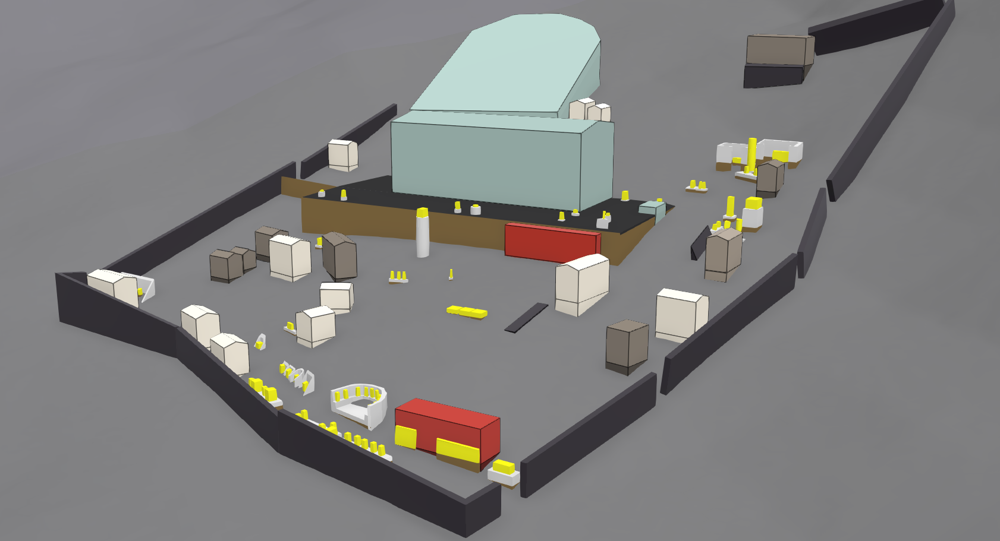
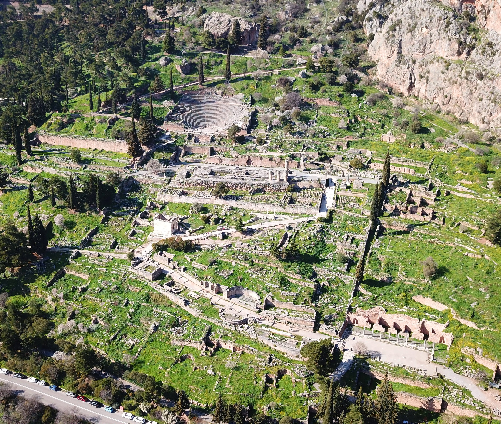
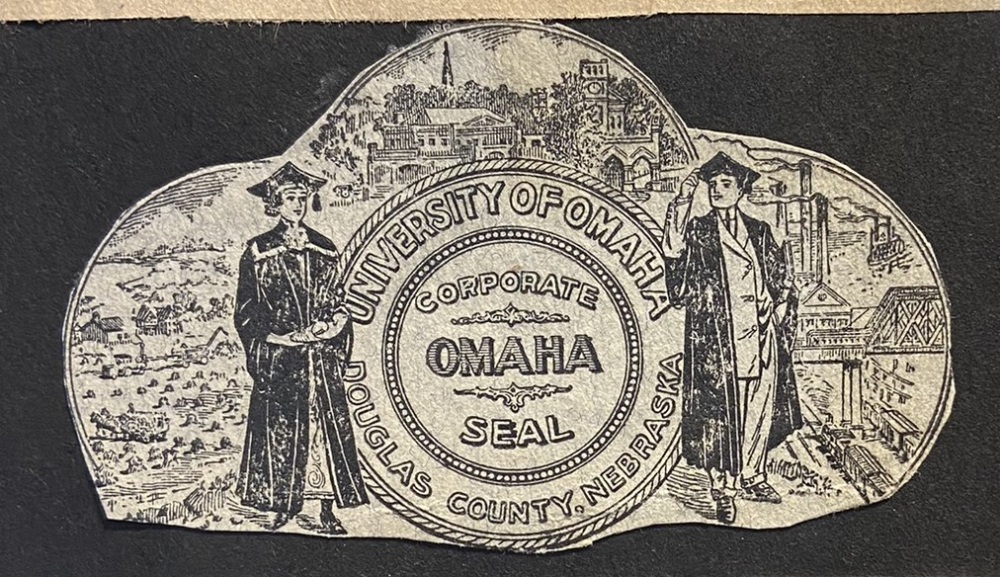
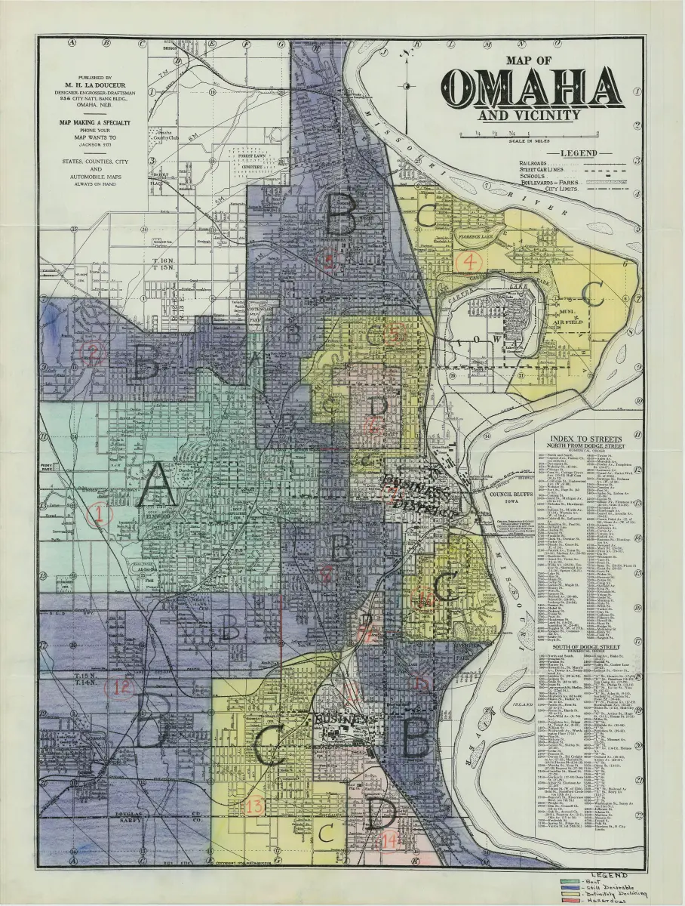

# Projects / Papers / Conferences

## Echoes of the Oracle

This project utilizes ArcGIS to digitally reconstruct ancient Delphi, offering an immersive exploration of its sacred landscape. By blending historical research, archaeology, and digital technology, it brings the sanctuary to life, shedding light on its religious, cultural, and political significance.

Delphi was more than just a religious center, it was a place where prophecy shaped decision making, where devotion intersected with identity, and where history was inscribed into the very landscape. Through this digital recreation, we gain a deeper understanding of how the ancient world perceived and engaged with this legendary site, allowing us to see Delphi not as a distant ruin but as a vibrant and dynamic space of belief, power, and tradition. 

Explore the three sections below to gain a deeper understanding of how the ancient world perceived and engaged with this legendary site, in which Delphi is not a distant ruin, but a vibrant and dynamic space of belief, power, and tradition.

### [**📍 Explore Echoes of the Oracle →**](https://digitalhistory.unomaha.community/echoes-of-the-oracle/)

## The College Experience (1910-1919)

Welcome to The College Experience (1910-1919). This digital project originated during my research at the University of Nebraska Omaha archives, where I discovered a remarkably small collection of only six student scrapbooks. The limited number of these materials initially captured my attention, but their historical significance proved even more compelling upon closer examination. These scrapbooks, created by six different students who attended UNO between 1910 and 1919, offer an extraordinary window into the formative years of the institution, which had only opened its doors in 1909.

The chronological proximity of these scrapbooks to the university's founding makes them particularly valuable primary sources. These materials document a pivotal moment when students and their experiences were actively shaping the evolving concept of college life in the American Midwest. Each scrapbook contains hundreds of ephemeral materials, including newspaper clippings, student records, handwritten notes, and various other artifacts that collectively illuminate the lived experiences of early twentieth-century college students.

This project aims to analyze these six surviving scrapbooks and present a digital exhibition that reconstructs the daily realities, cultural values, and social dynamics that defined collegiate life in the Midwest during the 1910s. Through thematic organization of materials drawn from across all six collections, visitors can explore multiple facets of this historical moment and gain insight into what it meant to be a college student during this transformative period in American higher education.

### [**🏛️ Explore The College Experience (1910-1919) →**](https://arcg.is/jP49K0)

## Redlining and Omaha: Using GIS to Understand History 

This GIS project investigates the enduring legacy of 1930s redlining in Omaha, Nebraska, by analyzing how discriminatory housing policies from the Great Depression era continue to shape urban inequality today. During the New Deal, the Home Owners' Loan Corporation (HOLC) created color-coded maps that systematically labeled minority neighborhoods as "hazardous" investment areas, a practice that was subsequently adopted by the Federal Housing Administration and other institutions, cementing decades of disinvestment. 

Using modern GIS software, the researcher overlaid historical HOLC redlining maps with contemporary census data on income, race, and population density, then conducted spatial analysis of essential services including hospitals, police stations, schools, fire stations, grocery stores, and recreational facilities across Omaha's census tracts. The findings reveal significant spatial disparities: lower-income neighborhoods—which correlate strongly with minority communities—have measurably reduced access to hospitals, police stations, and recreational facilities, while schools and fire stations show more equitable distribution. 

This analysis confirms that redlining's discriminatory geographic boundaries created structural inequalities that persist nearly a century later, demonstrating how historical policy decisions continue to determine access to resources and opportunities in American cities, and underscoring the value of GIS technology as a tool for historiographic analysis and urban justice research.

### [**🗺️ View Redlining and Omaha Project →**](https://arcg.is/14HPG50)

---

## Papers
Published Papers Coming Soon!

---

## Conferences
"*The Effects of Luxury Textiles on Medieval Europe*", 50th Annual European Studies Conference
University of Nebraska Omaha, October 2025.

"*Echoes of the Oracle: A Spatial Study of Delphi*", Classical Association Conference, University
of Manchester, April 2026. – (Conference Proposal Submitted)